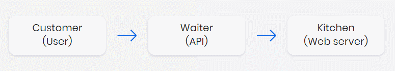
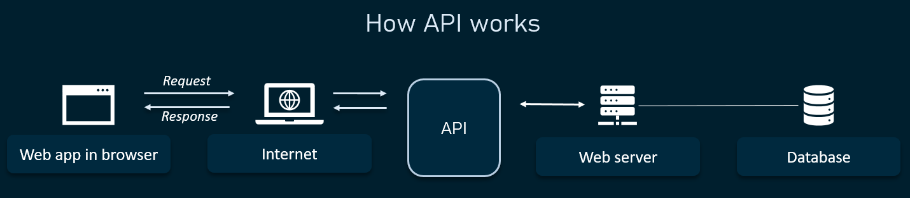
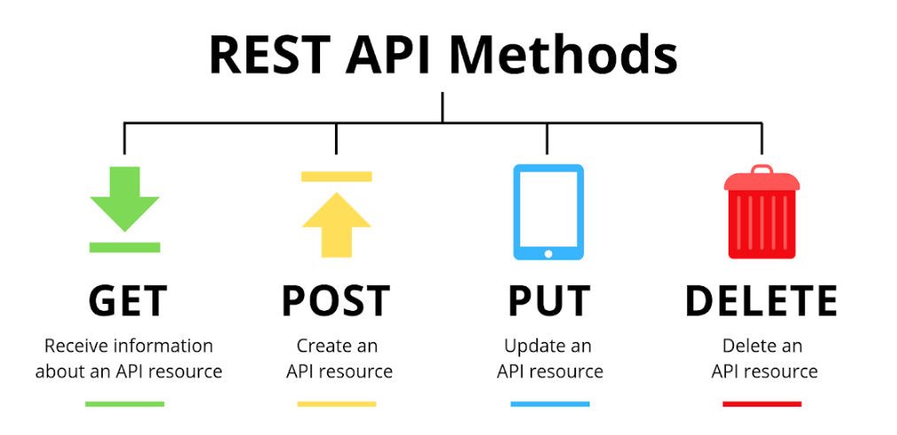
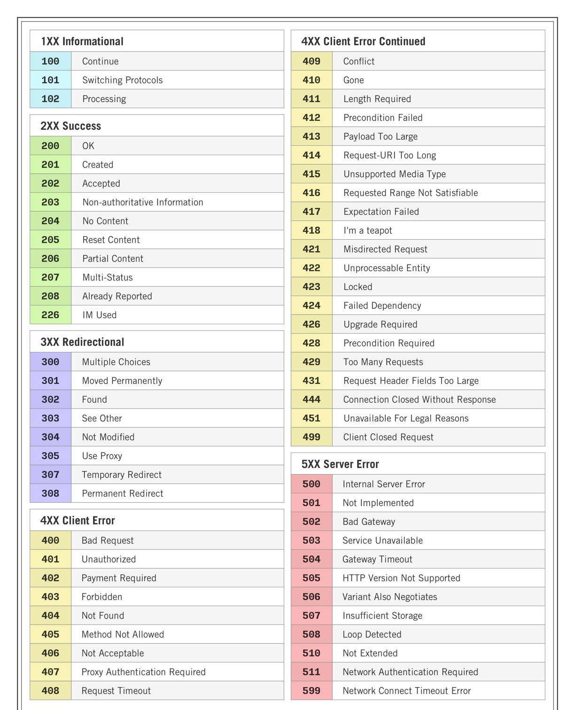

# Introduction

What is RestAssured?
-------------

* RestAssured is Java library which is highly used in API Test Automation. REST stands for **RE**presentational **S**tate **T**ransfer
* The libraries based on the RestAssured library are also capable of validating the HTTP responses from the server.
* Response status code, body, message, headers, and so on can be tested with the Rest Assured library.
* It can be integrated with build tools like Maven, unit test frameworks like JUnit and TestNG, Behavior Driven Development(BDD ).

What is API?
-------------
* API stands for Application Programming Interface that allows two application to interact with each other.

**For Example**: 

API like menu in Restaurant.The menu provides a list of dishes you can order, along with a description of each dish When you oder something,

the restaurant's kitchen does the work and provides you some dishes.You don't know exactly how the restaurant prepares that food, and you really don't want to know.

Similarly, API is the messenger that delivers your request to the provider that you are requesting it from and then delivers the response back to you.





Different API methods in RestAssured :
-------------

| Methods |                                          Description                                          | 
|---------|:---------------------------------------------------------------------------------------------:|
  | GET   |                       To Retrieves the information at a particular URL                        |
| POST    | 	Used to send information to the server like uploading data and also to develop a new entity. |
| PUT     |  Updates the previous resource if it exists or creates new information at a particular URL.   |
 |DELETE  |                    Deletes all current representations at a specific URL.                     |
 | PATCH  |                            Another method  used for partial updates of resources                             |




Prerequisites:
-------------

1. JDK (Java)
    + First thing we need Java (JDK) in your system To check JDK Version hit `java -version` command In CMD
2. IDE (Integrated Development Environment)
    + Second thing is we need IDE For java development. you can use Eclipse,IntelliJ or any other IDE
3. MAVEN
    + Maven provides functionality to automatically download dependency jar files for you and while building the jar/war u don't have to set up manually each time. Maven takes care of it.
    + `mvn install`This is one time command,This command builds the maven project and installs the project files (JAR, WAR, pom.xml, etc) to the local repository.

Links for Download Tools and softwares:
-------------

1. JDK      :  <https://www.oracle.com/java/technologies/downloads/>
2. Eclipse  : <https://www.eclipse.org/downloads/>
3. IntelliJ : <https://www.jetbrains.com/idea/download/#section=windows>
4. Maven    :  <https://maven.apache.org/download.cgi>

HTTP Status Code:
-------------

* When a browser requests a service from a web server, an error may occur. This is list of HTTP status messages that might be returned.



Required Dependencies:
-------------

* RestAssured
```xml
<!-- https://mvnrepository.com/artifact/io.rest-assured/rest-assured -->
<dependency>
    <groupId>io.rest-assured</groupId>
    <artifactId>rest-assured</artifactId>
    <version>5.1.1</version>
    <scope>test</scope>
</dependency>
```

Advantages and Disadvantages:
-------------
### Advantages :
1. It is an Open source i.e. free
2. It requires less coding compare to Apache Http Client.
3. Easy parsing and validation of response in JSON and XML.
4. It follows BDD keywords like given(), when(), then() which makes code readable and supports clean coding.
5. It can be integrated with Maven and CICD.
6. It can be easily integrated with other Java libraries like TestNG, Junit as Test Framework and Extent Report, Allure Report for reporting purpose.
7. Supports JsonPath and XmlPath which helps in parsing JSON and XML response. Rest Assured by default integrates both.
8. Quick assertion for status code and response time.

### Disadvantages :
1. Does not support testing of SOAP APIs explicitly.
2. No inbuilt reporting. Serenity BDD is a good option here.
3. Supports only Java Language.

Reference Material:
-------------

* [RestAssured Biginner Tutorials Playlist](https://www.youtube.com/playlist?list=PLhW3qG5bs-L8xPrBwDv66cTMlFNeUPdJx)
* [RestAssured GitHub page](https://rest-assured.io/)
* [RestAssured Article](https://www.hascode.com/2011/10/testing-restful-web-services-made-easy-using-the-rest-assured-framework/)
* [API Introduction](https://hevodata.com/learn/restassured-framework/)
* [RestAssured Tutorial](https://www.toolsqa.com/rest-assured-tutorial/)
